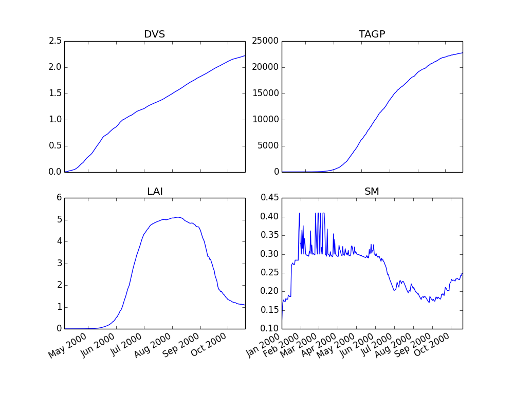

***************
Getting started
***************

This quickstart guide will help you to install PCSE and provides
some examples to get you started with modelling. All examples are currently focused on applying
the WOFOST crop simulation model, although other crop simulations may become available within
PCSE in the future.

1: An interactive PCSE/WOFOST session
=====================================

The easiest way to demonstrate PCSE is to import WOFOST from PCSE and run it from
an interactive Python session. We will be using the `start_wofost()` script that
connects to a the demo database which contains meteorologic data, soil data
and crop data for a grid location in South-Spain.

Initializing PCSE/WOFOST and advancing model state
--------------------------------------------------
Let's start a WOFOST object for modelling winter-wheat (crop=1) on a
location in South-Spain (grid 31031) for the year 2000 under water-limited
conditions for a freely draining soil (mode='wlp')::

    >>> wofost_object = pcse.start_wofost(grid=31031, crop=1, year=2000, mode='wlp')
    >>> type(wofost_object)
    <class 'pcse.models.Wofost71_WLP_FD'>

You have just successfully initialized a PCSE/WOFOST object in the python
interpreter, which is in its initial state and waiting to do some simulation. We
can now advance the model state for example with 1 day::

    >>> wofost_object.run()

Advancing the crop simulation with only 1 day, is often not so useful so the
number of days to simulate can be specified as well::

    >>> wofost_object.run(days=10)

Getting information about state and rate variables
--------------------------------------------------
Retrieving information about the calculated model states or rates 
can be done with the `get_variable()` method on a PCSE object.
For example, to retrieve the leaf area index value in the current
model state you can do::

    >>> wofost_object.get_variable('LAI')
    0.28708095263317146 
    >>> wofost_object.run(days=25)
    >>> wofost_object.get_variable('LAI')
    1.5281215808337203

Showing that after 11 days the LAI value is 0.287. When we increase time
with another 25 days, the LAI increases to 1.528. The `get_variable` method
can retrieve any state or rate variable that is defined somewhere in the
model. Finally, we can finish the crop season by letting it run until the
model terminates and store the results to a file 'myresults.csv'::

    >>> wofost_object.run_till_terminate()
    >>> wofost_object.store_to_file("myresults.txt")

Which should look like this :download:`myresults.txt`

2: Running PCSE/WOFOST with custom input data
=============================================

.. note::
    The inputs for PCSE models have been restructured and consist of three
    parts: 1) model parameters (soil, crop and site parameters), 2) driving variables
    and 3) agromanagement actions (what used  be called 'timerdata').
    The description here for running PCSE/WOFOST uses the old method for backward
    compatibility. However, this will change in future versions of PCSE.
    See also the section on running :ref:`PCSE/LINTUL3 <RunningLINTUL3>`.

For setting up PCSE/WOFOST with your
own data sources you should understand that WOFOST uses 5 different types of
inputs: `cropdata`, `soildata`, `timerdata`, `sitedata` and `driving variables`
(e.g. weather data). The fact that these names end with 'data' is a bit of
misnomer as they contain a mixture of parameter values, boundary conditions
and events rather than data, except for the driving variables which
can be considered as (observed) data. This terminology was inherited from the 
previous WOFOST versions and it was kept because changing it would
cause more confusion. PCSE provides several tools for reading parameters and
weather data from files or databases.

For the second example we will run a simulation for sugar beet in
Wageningen (Netherlands) and we will read the input data step by step from
several different sources instead of using the pre-configured `start_wofost()`
script. For the example we will assume that data files are in the directory
`D:\\userdata\\pcse_examples` and all the parameter files needed can be
found by unpacking this zip file :download:`quickstart_part2.zip`.

First we will import the necessary modules and define the data directory.
We also assume that you have the matplotlib package installed on your
system.::

    >>> import os
    >>> import pcse
    >>> import matplotlib.pyplot as plt
    >>> data_dir = r'D:\userdata\pcse_examples'

Cropdata
--------

Cropdata consist of parameter names (dictionary keys) and the
corresponding parameter values that are needed to parameterize the
components of the crop simulation model. These are
crop-specific values regarding phenology, assimilation, respiration,
biomass partitioning, etc. The parameter file for sugar beet
is taken from the crop files in the `WOFOST Control Centre`_.

.. _WOFOST Control Centre: http://www.wageningenur.nl/wofost

The crop parameter values for many models in
Wageningen are often provided in the CABO format that could be read
with the `TTUTIL <http://edepot.wur.nl/17847>`_ FORTRAN library. PCSE
tries to be backward compatible as much as possible and provides the
:ref:`CABOFileReader <CABOFileReader>` for reading parameter files in CABO format::

    >>> from pcse.fileinput import CABOFileReader
    >>> cropfile = os.path.join(data_dir, 'sug0601.crop')
    >>> cropdata = CABOFileReader(cropfile)
    >>> print cropdata

printing the cropdata dictionary gives you an listing of the header and
all parameters and their values.

Soildata
--------

The soildata dictionary must provide the parameter name/value pairs related
to the soil type and soil physical properties. The number of parameters is
variable depending on the soil water balance type that is used for the
simulation. For this example, we will use the water balance for freely
draining soils and use the soil file for medium fine sand: `ec3.soil`.
This file is also taken from the soil files in the `WOFOST Control Centre`_ ::

    >>> soilfile = os.path.join(data_dir, 'ec3.soil')
    >>> soildata = CABOFileReader(soilfile)

Timerdata
---------

The timerdata dictionary provides the start date of the water balance,
the start date and type of the crop simulation, the end date and type of the crop
simulation and the maximum duration of the crop simulation. The latter is
included to avoid unrealistically long simulations for example as a results of
a too high temperature sum requirement. These values are used by the AgroManagement
unit of PCSE. Currently, there is only an AgroManagement unit for single cropping
seasons but will change in the future allowing for crop rotations. Therefore,
the approach for providing AgroManagement data (timerdata) will change.

The following list gives an overview of the parameter names, values and types that
need to be specified in the `timerdata` dictionary::

        CAMPAIGNYEAR: year of the agricultural campaign (e.g. harvest year)
          START_DATE: date of the start of the simulation
            END_DATE: date last possible day of the simulation
     CROP_START_TYPE: 'emergence' or 'sowing'
     CROP_START_DATE: date of the start of the crop simulation
       CROP_END_TYPE: 'maturity' | 'harvest' |'earliest'
       CROP_END_DATE: date of the end of the crop simulation in case of CROP_END_TYPE == 'harvest' | 'earliest'
        MAX_DURATION: maximum number of days of the crop simulation

The CABO format does provide support date/time values, but the CABOFilereader
cannot yet parse them. Moreover, python supports date/time value natively and
they can be defined using the python-based PCSE file format. The crop calendar
file for sugar beet in Wageningen `sugarbeet_calendar.pcse` can be read with
the :ref:`PCSEFileReader <PCSEFileReader>`::

    >>> from pcse.fileinput import PCSEFileReader
    >>> crop_calendar_file = os.path.join(data_dir, 'sugarbeet_calendar.pcse')
    >>> timerdata = PCSEFileReader(crop_calendar_file)
    >>> print timerdata
    PCSE parameter file contents loaded from:
    D:\\userdata\\pcse_examples\\sugarbeet_calendar.pcse

    CAMPAIGNYEAR: 2000 (<type 'int'>)
    CROP_START_DATE: 2000-04-05 (<type 'datetime.date'>)
    END_DATE: 2000-12-31 (<type 'datetime.date'>)
    MAX_DURATION: 300 (<type 'int'>)
    CROP_END_DATE: 2000-10-20 (<type 'datetime.date'>)
    CROP_START_TYPE: emergence (<type 'str'>)
    CROP_END_TYPE: harvest (<type 'str'>)
    START_DATE: 2000-01-01 (<type 'datetime.date'>)

Sitedata
--------

The sitedata dictionary provides ancillary parameters that are not related to
the crop, the soil or the agromanagement. Examples are the initial conditions of
the water balance such as the initial soil moisture content (WAV) and
the initial and maximum surface storage (SSI, SSMAX). For the moment, we will
define these parameters directly on the python commandline::

    >>> sitedata = {'SSMAX'  : 0.,
                    'IFUNRN' : 0,
                    'NOTINF' : 0,
                    'SSI'    : 0,
                    'WAV'    : 100,
                    'SMLIM'  : 0.03}

Driving variables (weather data)
--------------------------------

Daily weather variables are needed for running the simulation. Currently, four
options are available in PCSE for retrieving weather data:

    1. The database structure as provided by the Crop Growth Monitoring
       System. Weather data will be read from the GRID_WEATHER table which
       is implemented using :ref:`GridWeatherDataProvider <GridWeatherDataProvider>`.
    2. The file structure as defined by the `CABO Weather System`_ which is
       implemented using :ref:`CABOWeatherDataProvider <CABOWeatherDataProvider>`.
    3. The file structure used by the `CABO Weather System`_ but implemented as an
       Excel sheet by :ref:`ExcelWeatherDataProvider <ExcelWeatherDataProvider>`
    4. The global weather data provided by the agroclimatology from the
       `NASA Power database`_ at a resolution of 1x1 degree. PCSE
       provides the :ref:`NASAPowerWeatherDataProvider <NASAPowerWeatherDataProvider>` which retrieves
       the NASA Power data from the internet for a given latitude and
       longitude.

.. _CABO Weather System: http://edepot.wur.nl/43010
.. _NASA Power database: http://power.larc.nasa.gov

For this example we will use the weather data from the NASA Power database
for the location of Wageningen. Note that it can take around 30 seconds
to retrieve the weather data from the NASA Power server the first time::

    >>> from pcse.db import NASAPowerWeatherDataProvider
    >>> wdp = NASAPowerWeatherDataProvider(latitude=52, longitude=5)
    >>> print wdp
    Weather data provided by: NASAPowerWeatherDataProvider
    --------Description---------
    NASA/POWER Agroclimatology Daily Averaged Data
    Dates (month/day/year): 01/01/1984 through 05/10/2014
    Location: Latitude 52   Longitude 5
    Location clarification: Integer values may indicate the lower left (south and west)
    corner of the one degree lat/lon region that includes the requested locations
    Elevation (meters): Average for one degree lat/lon region = 5
    Methodology Documentation:
    *Vegetation type: "Airport": flat rough grass
    ----Site characteristics----
    Elevation:    5.0
    Latitude:  52.000
    Longitude:  5.000
    Data available for 1997-01-01 - 2014-01-31
    Number of missing days: 47

Importing, initializing and running a PCSE model
------------------------------------------------

Internally, PCSE uses a simulation `engine` to run a crop simulation. This
engine takes a configuration file that specifies the components for the crop,
the soil and the agromanagement that need to be used for the simulation.
So any PCSE model can be started by importing the `engine` and initializing
it with a given configuration file and the corresponding sitedata, cropdata,
soildata, timerdata and weather data.

However, as many users of PCSE only need a particular configuration (for
example the WOFOST model for potential production), preconfigured Engines
are provided in `pcse.models`. For the sugarbeet example we will import
the WOFOST model for water-limited simulation under freely draining soil
conditions::

    >>> from pcse.models import Wofost71_WLP_FD
    >>> wofsim = Wofost71_WLP_FD(sitedata, timerdata, soildata, cropdata, wdp)

We can then run the simulation and show some final results such as the anthesis and
harvest dates (DOA, DOH), total biomass (TAGP) and maximum LAI (LAIMAX).
Next, we retrieve the time series of daily simulation output using the `get_output()`
method on the WOFOST object::

    >>> wofsim.run(days=400)
    >>> print wofsim.get_variable("DOA")
    2000-06-09
    >>> print wofsim.get_variable("DOH")
    2000-10-20
    >>> print wofsim.get_variable("TAGP")
    22783.5023325
    >>> print wofsim.get_variable("LAIMAX")
    5.11868342855
    >>> output = wofsim.get_output()
    >>> len(output)
    294

As the output is returned as a list of dictionaries, we need to unpack these variables
from the list of output::

    >>> varnames = ["day", "DVS", "TAGP", "LAI", "SM"]
    >>> tmp = {}
    >>> for var in varnames:
    >>>     tmp[var] = [t[var] for t in output]

Finally, we can generate some figures of WOFOST variables such as the
development (DVS), total biomass (TAGP), leaf area
index (LAI) and root-zone soil moisture (SM) using the `MatPlotLib`_ plotting package::

    >>> day = tmp.pop("day")
    >>> fig, axes = plt.subplots(nrows=2, ncols=2, figsize=(10,8))
    >>> for var, ax in zip(["DVS", "TAGP", "LAI", "SM"], axes.flatten()):
    >>>     ax.plot_date(day, tmp[var], 'b-')
    >>>     ax.set_title(var)
    >>> fig.autofmt_xdate()
    >>> fig.savefig('sugarbeet.png')

.. _MatPlotLib: http://matplotlib.org/

This should provide generate a figure of the simulation results as shown below. The complete python
script for this examples can be downloaded here :download:`quickstart_demo2.py`

.. _RunningLINTUL3:

3. Running a simulation with PCSE/LINTUL3
=========================================

The LINTUL model (Light INTerception and UtiLisation) is a simple generic crop model, which simulates dry
matter production as the result of light interception and utilization with a constant light use efficiency.
In PCSE the LINTUL family of models has been implemented including the LINTUL3 model which is used for
simulation of crop production under water-limited and nitrogen-limited conditions.

For the third example, we will use LINTUL3 for simulating spring-wheat in the Netherlands under water-limited
and nitrogen-limited conditions. We will again assume that data files are in the directory
`D:\\userdata\\pcse_examples` and all the parameter files needed can be
found by unpacking this zip file :download:`quickstart_part3.zip`.

First we will import the necessary modules and define the data directory. We also assume that you have the
`matplotlib`_, `pandas`_ and `PyYAML`_ packages installed on your system.::

    >>> import os
    >>> import pcse
    >>> import matplotlib.pyplot as plt
    >>> import pandas as pd
    >>> import yaml
    >>> data_dir = r'D:\userdata\pcse_examples'

.. _pandas: http://pandas.pydata.org
.. _PyYAML: http://pyyaml.org/wiki/PyYAML

For running the PCSE/LINTUL3 (and PCSE models in general), you need three types of inputs:

1. Model parameters that parameterize the different model components. These parameters usually
   consist of a set of crop parameters (or multiple sets in case of crop rotations), a set of soil parameters
   and a set of site parameters. The latter provide ancillary parameters that are specific for a location.
2. Driving variables represented by weather data which can be derived from various sources.
3. Agromanagement actions which specify the farm activities that will take place on the field that is simulated
   by PCSE. For defining the agromanagement we will use the new `AgroManager` which replaces the `timerdata`
   definition that was used previously.

Reading model parameters
------------------------
Model parameters can be easily read from the input files using the `PCSEFileReader` as we have seen
in the previous example::

    >>> from pcse.fileinput import PCSEFileReader
    >>> crop = PCSEFileReader(os.path.join(data_dir, "lintul3_springwheat.crop"))
    >>> soil = PCSEFileReader(os.path.join(data_dir, "lintul3_springwheat.soil"))
    >>> site = PCSEFileReader(os.path.join(data_dir, "lintul3_springwheat.site"))

However, PCSE models expect a single set of parameters and therefore they need to be combined using the
`ParameterProvider`::

    >>> from pcse.base_classes import ParameterProvider
    >>> parameters = ParameterProvider(soildata=soil, cropdata=crop, sitedata=site)

Reading weather data
--------------------
For reading weather data we will use the ExcelWeatherDataProvider. This WeatherDataProvider uses nearly the same
file format as is used for the CABO weather files but stores its data in an MicroSoft Excel file which makes the
weather files easier to create and update::

    >>> from pcse.fileinput import ExcelWeatherDataProvider
    >>> weather = ExcelWeatherDataProvider(os.path.join(data_dir, "nl1.xlsx"))

Defining agromanagement
-----------------------
Defining agromanagement needs a bit more explanation because agromanagement is a relatively
complex piece of PCSE. The agromanagement definition for PCSE is written in a format called `YAML`_ and
for the current example looks like this:

.. code:: yaml

    Version: 1.0
    AgroManagement:
    - 2006-01-01:
        CropCalendar:
            crop_id: spring-wheat
            crop_start_date: 2006-03-31
            crop_start_type: emergence
            crop_end_date: 2006-08-20
            crop_end_type: earliest
            max_duration: 300
        TimedEvents:
        -   event_signal: apply_n
            name:  Nitrogen application table
            comment: All nitrogen amounts in g N m-2
            events_table:
            - 2006-04-10: {amount: 10, recovery: 0.7}
            - 2006-05-05: {amount:  5, recovery: 0.7}
        StateEvents: null

.. _YAML: http://yaml.org/

The agromanagement definition starts with `Version:` indicating the version number of the agromanagement file
while the actual definition starts after the label `AgroManagement:`. Next a date must be provide which sets the
start date of the campaign (and the start date of the simulation). Each campaign is defined by zero or one
CropCalendars and zero or more TimedEvents and/or StateEvents. The CropCalendar defines the crop type, date of sowing,
date of harvesting, etc. while the Timed/StateEvents define actions that are either connected to a date or
to a model state.

In the current example, the campaign starts on 2006-01-01, there is a crop calendar for spring-wheat starting on
2006-03-31 with a harvest date of 2006-08-20 or earlier if the crop reaches maturity before this date.
Next there are timed events defined for applying N fertilizer at 2006-04-10 and 2006-05-05. The current example
has no state events. For a thorough description of all possibilities see the section on AgroManagement in the
Reference Guide.

Loading the agromanagement definition must by done with the YAMLAgroManagementReader::

    >>> from pcse.fileinput import YAMLAgroManagementReader
    >>> agromanagement = YAMLAgroManagementReader(os.path.join(data_dir, "lintul3_springwheat.amgt"))
    >>> print(agromanagement)
    !!python/object/new:pcse.fileinput.yaml_agmt_loader.YAMLAgroManagementReader
    listitems:
    - 2006-01-01:
        CropCalendar:
          crop_end_date: 2006-10-20
          crop_end_type: earliest
          crop_id: spring-wheat
          crop_start_date: 2006-03-31
          crop_start_type: emergence
          max_duration: 300
        StateEvents: null
        TimedEvents:
        - comment: All nitrogen amounts in g N m-2
          event_signal: apply_n
          events_table:
          - 2006-04-10:
              amount: 10
              recovery: 0.7
          - 2006-05-05:
              amount: 5
              recovery: 0.7
          name: Nitrogen application table

Starting and running the LINTUL3 model
--------------------------------------
We have now all parameters, weather data and agromanagement information available to start the LINTUL3 model.