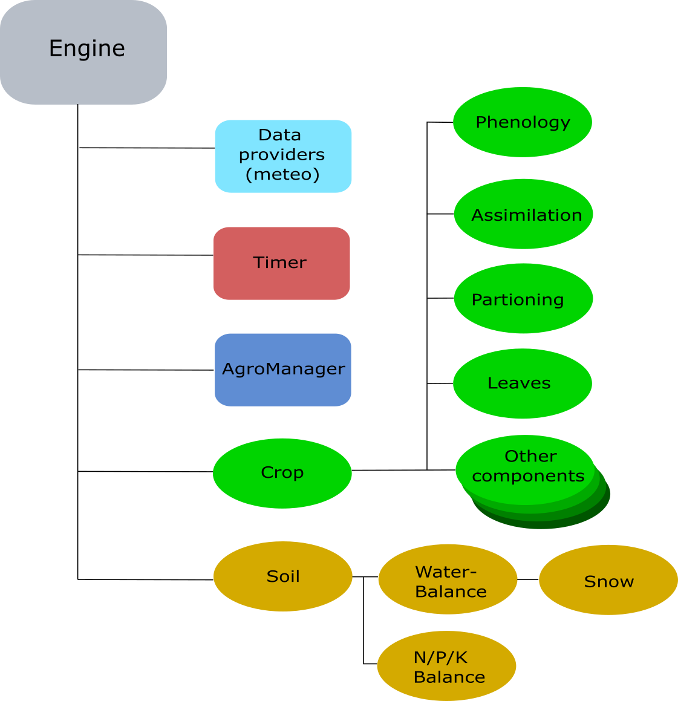

.. include:: abbreviations.txt
###############
Reference Guide
###############

An overview of PCSE
===================

The Python Crop Simulation Environment builds on the heritage
provided by the earlier approaches developed in Wageningen,
notably the Fortran Simulation Environment. The `FSE manual <http://edepot.wur.nl/35555>`_
(van Kraalingen, 1995) provides a very good overview on the principles of Euler integration
and its application to crop simulation models. Therefore, we will not discuss this in detail
here.

Nevertheless, PCSE also tries to improve on these approaches
by separating the simulation logic into a number of
distinct components that play a role in the implementation of (crop)
simulation models:

 1. The dynamic part of the simulation is taken care of by a
    dedicated simulation `Engine` which handles the initialization,
    the ordering of rate/state updates for the soil and plant
    modules as well as keeping track of time, retrieving weather data and
    calling the agromanager module.
 2. Solving the differential equations for soil/plant system and updating
    the model state is deferred to SimulationObjects that
    implement (bio)physical processes such as phenological development
    or |CO2| assimilation.
 3. An AgroManager module is included which takes care of
    signalling agricultural management actions such as sowing, harvesting,
    irrigation, etc.
 4. Communication between PCSE components is implemented by either exporting
    variables into a shared state object or by implementing signals that can be
    broadcasted and received by any PCSE object.
 5. Several tools are available for providing weather data and
    reading parameter values from files or databases.

Next, an overview of the different components in PCSE will be provided.

The Engine
==========

The PCSE Engine provides the environment where the simulation takes place.
The engine takes care of reading the model configuration, initializing model
components, driving the simulation
forward by calling the SimulationObjects, calling the agromanagement
unit, keeping track of time, providing the weather data needed and
storing the model variables during the simulation for later output.
The Engine itself is generic and can be used for any model that is defined
in PCSE. The overall structure of the engine can be found in the figure below
which shows the different elements that are called by the Engine.

.. _ContinuousSimulation:

Continuous simulation in PCSE
-----------------------------

To implement continuous simulation, the engine uses the same approach as
FSE: Euler integration with a fixed time step of one day.  The following
figure shows the principle of continuous simulation
and the execution order of various steps.

.. figure:: figures/continuous_simulation.png
   :align: center
   :width: 500 px

   Order of calculations for continuous simulation using Euler integration
   (after Van Kraalingen, 1995).

The steps in the process cycle that are shown in the figure above are
implemented in the simulation `Engine` which is completely separated
from the model logic itself. Moreover, it demonstrates that before
the simulation can start the engine has to be initialized which involves
several steps:

1. The model configuration must be loaded;
2. The AgroManager module must be initialized and called to determine
   the first and last of the simulation sequence;
3. The timer must be initialized with the first and last day of the
   simulation sequence;
4. The soil component specified in the model configuration must be
   initialized.
5. The weather variables must be retrieved for the starting day;
6. The AgroManager must be called to trigger any management events that
   are scheduled for the starting day.
7. The initial rates of change based on the initial states and driving
   variables must be calculated;
8. Finally, output can be collected to save the initial states and rates of
   the simulation.

The next cycle in the simulation will now start with an update of the timer to
the next time step (e.g. day). Next, the rates of change of
the previous day will be integrated onto the state variables and the driving
variables for the current day will be retrieved. Finally, the rates of change
will be recalculated based on the new driving variables and updated model
states and so forth.

The simulation loop will terminate when some finish condition has been reached.
Usually, the `AgroManager` module will encounter the end of the agricultural
campaign and will broadcast a terminate signal that terminates the entire simulation.

Input needed by the Engine
--------------------------

To start the Engine four inputs are needed:

1. A weather data provider that provides the Engine with the daily values
   of weather variables. See the section on `Weather data providers`_ for an
   overview of the different options for providing weather data.
2. A set of parameters that is needed to parameterize the SimulationObjects
   that simulate the soil and crop processes. Model parameters can be retrieved
   from different sources like files or databases. PCSE uses three sets of model
   parameters: crop parameters, soil parameters and site parameters. The latter
   present an ancillary set of parameters that are not related to the soil or
   the crop. The atmospheric CO2 concentration is a typical example of a site
   parameter. Despite having three sets of parameters, all parameters are
   encapsulated using a `ParameterProvider`
   that provides a uniform interface to access the different parameter sets.
   See the section on `Data providers for parameter values`_ for an overview.
3. Agromanagement information that is needed to schedule agromanagement
   actions that are taking place during the simulation. See the sections
   on `The AgroManager`_ and `Data providers for agromanagement`_ for a
   detailed overview.
4. A configuration file that tells the Engine the details of the simulation
   such as the components to use for the simulation of the crop, the soil and
   the agromanagement. Moreover, the results that should be stored as final and
   intermediate outputs and some other details.

Engine configuration files
--------------------------

The engine needs a configuration file that specifies which components should
be used for simulation and additional information. This is most easily
explained by an example such as the configuration file for the WOFOST 7.2 model
for potential crop production::

    # -*- coding: utf-8 -*-
    # Copyright (c) 2004-2021 Wageningen Environmental Research
    # Allard de Wit (allard.dewit@wur.nl), August 2021
    """PCSE configuration file for WOFOST 7.2 Potential Production simulation

    This configuration file defines the soil and crop components that
    should be used for potential production simulation.
    """

    from pcse.soil.classic_waterbalance import WaterbalancePP
    from pcse.crop.wofost7 import Wofost
    from pcse.agromanager import AgroManager

    # Module to be used for water balance
    SOIL = WaterbalancePP

    # Module to be used for the crop simulation itself
    CROP = Wofost

    # Module to use for AgroManagement actions
    AGROMANAGEMENT = AgroManager

    # variables to save at OUTPUT signals
    # Set to an empty list if you do not want any OUTPUT
    OUTPUT_VARS = ["DVS","LAI","TAGP", "TWSO", "TWLV", "TWST",
                   "TWRT", "TRA", "RD", "SM", "WWLOW"]
    # interval for OUTPUT signals, either "daily"|"dekadal"|"monthly"|"weekly"
    # For daily output you change the number of days between successive
    # outputs using OUTPUT_INTERVAL_DAYS. For dekadal and monthly
    # output this is ignored.
    OUTPUT_INTERVAL = "daily"
    OUTPUT_INTERVAL_DAYS = 1
    # Weekday: Monday is 0 and Sunday is 6
    OUTPUT_WEEKDAY = 0

    # Summary variables to save at CROP_FINISH signals
    # Set to an empty list if you do not want any SUMMARY_OUTPUT
    SUMMARY_OUTPUT_VARS = ["DVS","LAIMAX","TAGP", "TWSO", "TWLV", "TWST",
                           "TWRT", "CTRAT", "RD", "DOS", "DOE", "DOA",
                           "DOM", "DOH", "DOV", "CEVST"]

    # Summary variables to save at TERMINATE signals
    # Set to an empty list if you do not want any TERMINAL_OUTPUT
    TERMINAL_OUTPUT_VARS = []

As you can see, the configuration file is written in plain python code.
First of all, it defines the placeholders *SOIL*, *CROP* and
*AGROMANAGEMENT* that define the components that should be used for
the simulation of these processes. These placeholders simply point to
the modules that were imported at the start of the configuration file.

.. note::
    Modules in configuration files must be imported using fully qualified
    names and relative imports cannot be used.

The second part is for defining the
variables (*OUTPUT_VARS*) that should be stored during the model run
(during OUTPUT signals) and the details of the regular output interval.
Next, summary output *SUMMARY_OUTPUT_VARS* can be defined that will be generated at the end
of each crop cycle. Finally, output can be collected at the end of the
entire simulation (*TERMINAL_OUTPUT_VARS*).

.. note::
    Model configuration files for models that are included in the PCSE package
    reside in the 'conf/' folder inside the package. When the Engine is started
    with the name of a configuration file, it searches this folder to locate the file.
    This implies that if you want the start the Engine with your own (modified)
    configuration file, you *must* specify it as an absolute path
    otherwise the Engine will not find it.

The relationship between models and the engine
----------------------------------------------

Models are treated together with the Engine, because models are simply
pre-configured Engines. Any model can be started by starting the Engine
with the appropriate configuration file. The only difference is that
models can have methods that deal with specific characteristics of a model.
This kind of functionality cannot be implemented in the Engine because
the model details are not known beforehand.

SimulationObjects
=================

PCSE  uses SimulationObjects to group parts of the crop simulation model
that form a logical entity into separate program code sections. In this
way the crop simulation model is grouped into sections that implement certain
biophysical processes such as phenology, assimilation, respiration, etc.
Simulation objects can be grouped to form components that perform the simulation
of an entire crop or a soil profile.

This approach has several advantages:

#. Model code with a certain purpose is grouped together, making it easier
   to read, understand and maintain.
#. A SimulationObject contains only parameters, rate and state variables
   that are needed. In contrast, with monolythic code it is often unclear (at
   first glance at least) what biophysical process they belong to.
#. Isolation of process implementations creates less dependencies, but more
   importantly, dependencies are evident from the code which makes it easier
   to modify individual SimulationObjects.
#. SimulationObjects can be tested individually by comparing output vs the
   expected output (e.g. unit testing).
#. SimulationObjects can be exchanged for other objects with the same purpose
   but a different biophysical approach. For example, the WOFOST assimilation
   approach could be easily replaced by a more simple Light Use Efficiency or
   Water Use Efficiency approach, by replacing the SimulationObject that
   handles the |CO2| assimilation.

Characteristics of SimulationObjects
------------------------------------

Each SimulationObject is defined in the same way and has a couple of standard
sections and methods which facilitates understanding and readability.
Each SimulationObject has parameters to define the mathematical relationships,
it has state variables to define the state of the system and it has rate
variables that describe the rate of change from one time step to the next.
Moreover, a SimulationObject may contain other SimulationObjects that
together form a logical structure. Finally, the SimulationObject must implement
separate code sections for initialization, rate calculation and integration
of the rates of change. A finalization step which is called at the end of the simulation
can be added optionally.

The skeleton of a SimulationObject looks like this:

.. code-block:: python

    class CropProcess(SimulationObject):

        class Parameters(ParamTemplate):
            PAR1 = Float()
            # more parameters defined here

        class StateVariables(StatesTemplate):
            STATE1 = Float()
            # more state variables defined here

        class RateVariables(RatesTemplate):
            RATE1 = Float()
            # more rate variables defined here

        def initialize(self, day, kiosk, parametervalues):
            """Initializes the SimulationObject with given parametervalues."""
            self.params = self.Parameters(parametervalues)
            self.rates = self.RateVariables(kiosk)
            self.states = self.StateVariables(kiosk, STATE1=0., publish=["STATE1"])

        @prepare_rates
        def calc_rates(self, day, drv):
            """Calculate the rates of change given the current states and driving
            variables (drv)."""

            # simple example of rate calculation using rainfall (drv.RAIN)
            self.rates.RATE1 = self.params.PAR1 * drv.RAIN

        @prepare_states
        def integrate(self, day, delt):
            """Integrate the rates of change on the current state variables
            multiplied by the time-step
            """
            self.states.STATE1 += self.rates.RATE1 * delt

        @prepare_states
        def finalize(self, day):
            """do some final calculations when the simulation is finishing."""

The strict separation of program logic was copied from the Fortran Simulation
Environment (FSE, `Rappoldt and Van Kraalingen 1996 <http://edepot.wur.nl/4411>`_
and `Van Kraalingen 1995 <http://edepot.wur.nl/35555>`_) and
is critical to ensure that the simulation results are correct.
The different calculations types (integration, driving variables and
rate calculations) should be strictly separated. In other words, first all
states should be updated, subsequently all driving variables should be calculated,
after which all rates of change should be calculated. If this rule is not
applied rigorously, some rates may pertain to states at
the current time whereas others will pertain to states from the previous time
step. Compared to the FSE system and the
`FORTRAN implementation of WOFOST <https://github.com/ajwdewit/wofost>`_,
the `initialize()`, `calc_rates()`, `integrate()` and `finalize()` sections
match with the *ITASK* numbers 1, 2, 3, 4.

A complicating factor that arises when using modular code is how to arrange
the communication between SimulationObjects. For example, the `evapotranspiration`
SimulationObject will need information about the leaf area index from the
`leaf_dynamics` SimulationObject to calculate the crop transpiration
values. In PCSE the communication between
SimulationObjects is taken care of by the so-called `VariableKiosk`. The
metaphore kiosk is used because the SimulationObjects publish
their rate and/or state variables (or a subset) into the kiosk, other
SimulationObjects can subsequently request the variable value from the kiosk
without any knowledge about the SimulationObject that published it.
Therefore, the VariableKiosk is shared by all SimulationObjects and must
be provided when SimulationObjects initialize.

See the section on `Exchanging data between model components`_
for a detailed description of the variable kiosk and other ways to communicate
between model components.

Simulation Parameters
---------------------

Usually SimulationObjects have one or more parameters which should be defined as a subclass
of the `ParamTemplate` class.  Although parameters can be specified as part
of the SimulationObject definition directly, subclassing them from `ParamTemplate` has a few
advantages. First of all, parameters must be initialized and a missing parameter will lead to
an exception being raised with a clear message. Secondly, parameters are initialized as read-only
attributes which cannot be changed during the simulation. So occasionally overwriting a
parameter value is impossible this way.

The model parameters are initialized by the calling the Parameters class definition
and providing a dictionary with key/value pairs to define the parameters.

State/Rate variables
--------------------

The definitions for state and rate variables share many properties. Definitions of rate and
state variables should be defined as attributes of a class that inherit from
`RatesTemplate` and `StatesTemplate` respectively. Names of rate and state variables that
are defined this way **must** be unique across all model components and a duplicate variable
name somewhere across the model composition will lead to an exception.

Both class instances need the VariableKiosk as its first input parameter which is needed
to register the variables defined. Moreover, variables can be published with the `publish`
keyword as is done in the example above for *STATE1*. Publishing a variable means that it
will be available in the VariableKiosk and can be retrieved by other components based on the
name of the variables. The main difference between a rates and
a states class is that the states class requires you to provide the initial value of the
state as a keyword parameter in the call. Failing to provide the initial value will lead
to an exception being raised.

Instances of objects containing rate and state variables are read-only by default. In order
to change the value of a rate or state, the instance must be unlocked. For this purpose
the decorators `@prepare_rates` and `@prepare_states` are being placed in front of the calls
to `calc_rates()` and `integrate()` which take care of unlocking and locking the states
and rates instances. Using this approach rate variables can only be changed during
the call where the rates are calculated, states variables are read-only at that stage.
Similarly, state variables can only be changed during the state update while the rates
of change are locked. This mechanism ensures that rate/state updates are carried out
in the correct order.

Finally, instances of RatesTemplate have one additional method, called `zerofy()` while
instances of StatesTemplate have one additional method called `touch()`.
Calling `zerofy()` is normally done by the Engine and explicitly sets all rates of change
to zero. Calling `touch()` on a states object is only useful when the states variables
do not need to be updated, but you do want to be sure that any published state variables
will remain available in the VariableKiosk.

The AgroManager
===============

Agromanagement is an intricate part of PCSE which is needed for
simulating the processes that are happening
on agriculture fields. In order for crops to grow, farmers must first plow the
fields and sow the crop. Next, they have to do proper management including
irrigation, weeding, nutrient application, pest control and finally harvesting.
All these actions have to be scheduled at specific dates, connected to certain
crop stages or in dependence of soil and weather conditions. Moreover specific
parameters such as the amount of irrigation or nutrients must be provided as well.

In previous versions of WOFOST, the options for agromanagement were limited to
sowing and harvesting. On the one had this was because agromanagement was often assumed
to be optimal and thus there was little need for detailed agromanagement.
On the other hand, implementing agromanagement is relatively complex because
agromanagement consists of events that are happening once rather than
continuously. As such, it does not fit well in the traditional simulation
cycle, see :ref:`ContinuousSimulation`.

Also from a technical point of view implementing such events through the traditional
function calls for rate calculation and state updates is not attractive. For
example, for indicating a nutrient application event several additional parameters
would have to be passed: e.g. the type of nutrient, the amount and its efficiency.
This has several drawbacks, first of all, only a limited number of SimulationObjects
will actually do something with this information while for all other objects, the
information is of no use. Second, nutrient application will usually happen only once
or twice in the growing cycle. So for a 200-day growing cycle there will be
198 days where the parameters do not carry any information. Nevertheless, they
would still be present in the function call, thereby decreasing the computational
efficiency and the readability of the code. Therefore, PCSE uses a very different
approach for agromanagement events which is based on signals (see :ref:`Broadcasting signals`).

.. _refguide_agromanagement:

Defining agromanagement in PCSE
-------------------------------

Defining the agromanagement in PCSE is not very complicated and first starts with
defining a sequence of campaigns. Campaigns
start on a prescribed calendar date and finalize when the next campaign starts.
Each campaign is characterized by zero or one crop calendar, zero or more timed events and
zero or more state events. The crop calendar specifies the timing of the crop (sowing,
harvesting) while the timed and state events can be used to specify management actions
that are either dependent on time (a specific date) or a certain model state variable
such as crop development stage. Crop calendars and event definitions are only valid
for the campaign in which they are defined.

The data format used for defining the agromanagement in PCSE is called YAML. YAML is a
versatile format optimized for readability by humans while still having the power of XML.
However, the agromanagement definition in PCSE is by no means tied to YAML and can be
read from a database as well.

The structure of the data needed as input for the AgroManager is most easily understood
with an example (below). The example definition consists of three campaigns, the first
starting on 1999-08-01, the second starting on 2000-09-01 and the last campaign starting
on 2001-03-01. The first campaign consists of a crop calendar for winter-wheat starting
with sowing at the given crop_start_date. During the campaign there are timed events for
irrigation at 2000-05-25 and 2000-06-30. Moreover, there are state events for  fertilizer
application (event_signal: apply_npk) given by development stage (DVS) at DVS 0.3, 0.6 and 1.12.

The second campaign has no crop calendar, timed events or state events. This means that
this is a period of bare soil with only the water balance running. The third campaign is
for fodder maize sown at 2001-04-15 with two series of timed events (one for irrigation and
one for N/P/K application) and no state events. The end date of the simulation in this case
will be 2001-11-01 (2001-04-15 + 200 days).

An example of an agromanagement definition file::

    AgroManagement:
    - 1999-08-01:
        CropCalendar:
            crop_name: wheat
            variety_name: winter-wheat
            crop_start_date: 1999-09-15
            crop_start_type: sowing
            crop_end_date:
            crop_end_type: maturity
            max_duration: 300
        TimedEvents:
        -   event_signal: irrigate
            name:  Timed irrigation events
            comment: All irrigation amounts in cm
            events_table:
            - 2000-05-25: {amount: 3.0, efficiency=0.7}
            - 2000-06-30: {amount: 2.5, efficiency=0.7}
        StateEvents:
        -   event_signal: apply_npk
            event_state: DVS
            zero_condition: rising
            name: DVS-based N/P/K application table
            comment: all fertilizer amounts in kg/ha
            events_table:
            - 0.3: {N_amount : 1, P_amount: 3, K_amount: 4, N_recovery=0.7, P_recovery=0.7, K_recovery=0.7}
            - 0.6: {N_amount: 11, P_amount: 13, K_amount: 14, N_recovery=0.7, P_recovery=0.7, K_recovery=0.7}
            - 1.12: {N_amount: 21, P_amount: 23, K_amount: 24, N_recovery=0.7, P_recovery=0.7, K_recovery=0.7}
    - 2000-09-01:
        CropCalendar:
        TimedEvents:
        StateEvents
    - 2001-03-01:
        CropCalendar:
            crop_name: maize
            variety_name: fodder-maize
            crop_start_date: 2001-04-15
            crop_start_type: sowing
            crop_end_date:
            crop_end_type: maturity
            max_duration: 200
        TimedEvents:
        -   event_signal: irrigate
            name:  Timed irrigation events
            comment: All irrigation amounts in cm
            events_table:
            - 2001-06-01: {amount: 2.0, efficiency=0.7}
            - 2001-07-21: {amount: 5.0, efficiency=0.7}
            - 2001-08-18: {amount: 3.0, efficiency=0.7}
            - 2001-09-19: {amount: 2.5, efficiency=0.7}
        -   event_signal: apply_npk
            name:  Timed N/P/K application table
            comment: All fertilizer amounts in kg/ha
            events_table:
            - 2001-05-25: {N_amount : 50, P_amount: 25, K_amount: 22, N_recovery=0.7, P_recovery=0.7, K_recovery=0.7}
            - 2001-07-05: {N_amount : 70, P_amount: 35, K_amount: 32, N_recovery=0.7, P_recovery=0.7, K_recovery=0.7}
        StateEvents:

Crop calendars
--------------

The crop calendar definition will be passed on to a `CropCalendar` object which is
responsible for storing, checking, starting and ending the crop cycle during a PCSE simulation.
At each time step the instance of `CropCalendar` is called
and at the dates defined by its parameters it initiates the appropriate actions:

- sowing/emergence: A `crop_start` signal is dispatched including the parameters needed to
  start the new crop simulation object (crop_name, variety_name, crop_start_type and crop_end_type)
- maturity/harvest: the crop cycle is ended by dispatching a `crop_finish` signal with the
  appropriate parameters.

For a detailed description of a crop calendar see the code documentation on the CropCalendar in the
section on :ref:`Agromanagement <AgromanagementCode>`.

Timed events
------------

Timed events are management actions that are occurring on specific dates. As simulations in PCSE run
on daily time steps it is easy to schedule actions on dates. Timed events are characterized by
an event signal, a name and comment that can be used to describe the event and finally an
events table that lists the dates for the events and the parameters that should be passed onward.

Note that when multiple events are connected to the same date, the order in which they trigger is
undetermined.

For a detailed description of a timed events see the code documentation on the TimedEventsDispatcher
in the section on :ref:`Agromanagement <AgromanagementCode>`.

State events
------------

State events are management actions that are tied to certain model states. Examples are actions such
as nutrient application that should be executed at certain crop stages, or irrigation application
that should occur only when the soil is dry. PCSE has a flexible definition of state events and an event
can be connected to any variable that is defined within PCSE.

Each state event is defined by an `event_signal`, an `event_state` (e.g. the model
state that triggers the event) and a `zero condition`. Moreover, an optional name and an
optional comment can be provided. Finally the events_table specifies at which model state values
the event occurs. The `events_table` is a list which provides for each state the parameters that
should be dispatched with the given event_signal.

Managing state events is more complicated than timed events because PCSE cannot determine beforehand at
which time step these events will trigger.
For finding the time step at which a state event occurs PCSE uses the concept of `zero-crossing`.
This means that a state event is triggered when (`model_state` - `event_state`) equals or
crosses zero. The `zero_condition` defines how this crossing should take place. The value of
`zero_condition` can be:

* `rising`: the event is triggered when (`model_state` - `event_state`) goes from a negative value towards
  zero or a positive value.
* `falling`: the event is triggered when (`model_state` - `event_state`) goes from a positive value towards
  zero or a negative value.
* `either`: the event is triggered when (`model_state` - `event_state`) crosses or reaches zero from any
  direction.

Note that when multiple events are connected to the same state value, the order in which they trigger is
undetermined.

For a detailed description of a state events see the code documentation on the StateEventsDispatcher
in the section on :ref:`Agromanagement <AgromanagementCode>`.

Finding the start and end date of a simulation
----------------------------------------------

The agromanager has the task to find the start and end date of the simulation based on the
agromanagement definition that has been provided to the Engine.
Getting the start date from the agromanagement definition is straightforward as this is
represented by the start date of the first campaign. However,
getting the end date is more complicated because there are several possibilities.
The first option is to explicitly define the end date of the simulation by adding a
'trailing empty campaign' to the agromanagement definition.
An example of an agromanagement definition with a 'trailing empty campaigns' (YAML format) is
given below. This example will run the simulation until 2001-01-01::

    Version: 1.0.0
    AgroManagement:
    - 1999-08-01:
        CropCalendar:
            crop_name: wheat
            variety_name: winter-wheat
            crop_start_date: 1999-09-15
            crop_start_type: sowing
            crop_end_date:
            crop_end_type: maturity
            max_duration: 300
        TimedEvents:
        StateEvents:
    - 2001-01-01:

The second option is that there is no trailing empty campaign and in that case the end date of the simulation
is retrieved from the crop calendar and/or the timed events that are scheduled. In the example below, the
end date will be 2000-08-05 as this is the harvest date and there are no timed events scheduled after this
date::

    Version: 1.0.0
    AgroManagement:
    - 1999-09-01:
        CropCalendar:
            crop_name: wheat
            variety_name: winter-wheat
            crop_start_date: 1999-10-01
            crop_start_type: sowing
            crop_end_date: 2000-08-05
            crop_end_type: harvest
            max_duration: 330
        TimedEvents:
        -   event_signal: irrigate
            name:  Timed irrigation events
            comment: All irrigation amounts in cm
            events_table:
            - 2000-05-01: {amount: 2, efficiency: 0.7}
            - 2000-06-21: {amount: 5, efficiency: 0.7}
            - 2000-07-18: {amount: 3, efficiency: 0.7}
        StateEvents:

In the case that there is no harvest date provided and the crop runs till maturity, the end date from
the crop calendar will be estimated as the `crop_start_date` plus the `max_duration`.

Note that in an agromanagement definition where the last campaign contains a definition for state events,
a trailing empty campaign *must* be provided because otherwise the end date cannot be determined. The
following campaign definition is valid (though silly) but there is no way to determine the end date
of the simulation. Therefore, this definition will lead to an error::

    Version: 1.0
    AgroManagement:
    - 2001-01-01:
        CropCalendar:
        TimedEvents:
        StateEvents:
        -   event_signal: irrigate
            event_state: SM
            zero_condition: falling
            name: irrigation scheduling on volumetric soil moisture content
            comment: all irrigation amounts in cm
            events_table:
            - 0.25: {amount: 2, efficiency: 0.7}

Exchanging data between model components
========================================

A complicating factor when dealing with modular code is how to exchange model states or other
data between the different components. PCSE implements two basic methods for exchanging variables:

1. The VariableKiosk which is primarily used to exchange state/rate variables between model components and
   where updates of the state/rate variables are needed at each cycle in the simulation process.
2. The use of signals that can be broadcasted and received by any PCSE object and which is primarily used to
   broadcast information as a response to events that are happening during the model simulation.

The VariableKiosk
-----------------

The VariableKiosk is an essential component in PCSE and it is created when the Engine starts.
Nearly all objects in PCSE receive a reference to the VariableKiosk and it has many functions
which may not be clear or appreciated at first glance.

First of all,
the VariableKiosk registers *all* state and rate variables which are defined as attributes of
a StateVariables or RateVariables class. By doing so, it also ensures that names are
unique; there cannot be two state/rate variables with the same name within the component hierarchy
of a single Engine. This uniqueness is enforced to avoid name conflicts between components that
would affect the publishing of variables or the retrieval of variables. For example,
`engine.get_variable("LAI")` will retrieve the leaf area index of the crop. However, if there
would be two variables named "LAI" it would be unclear which one is retrieved. It would not
even be guaranteed that it is the same variable between function calls or model runs.

Second, the VariableKiosk takes care of exchanging state and rate variables between model
components. Variables that are published by the RateVariables and StateVariables object will become
available in the VariableKiosk the moment when the variable gets a value assigned.
Within the PCSE internals, published variables have a trigger connected to them that copies their
value into the VariableKiosk. The VariableKiosk should therefore not be regarded as a shared
state object but rather as a cache that contains copies of variable name/value pairs.
Moreover, the updating of variables in the kiosk is protected. Only the
SimulationObject that registers and publishes a variable can change its value in the Kiosk.
All other SimulationObjects can query its value, but cannot alter it. Therefore it is
impossible for two processes to manipulate the same variable through the VariableKiosk.

A potential danger with having copies of variables in the kiosk is that copies do not
reflect the actual value anymore, for example due to a missing state update. In such case
the value of the state is "lagging" in the kiosk which is a potential simulation error.
To avoid such problems, the kiosk regularly 'flushes' its content. After a flush, the
variables remain registered in the kiosk, but their values become undefined. The flushing
of variables is taken care of by the engine and is done separately for rate and state
variables. After the update of all states, all rate variables are flushed; when the rate
calculation step is finished, all state variables in the kiosk are flushed. On the one hand,
this procedure helps to enforce that calculations are done in the right order. On the
other hand it also implies that in order to keep a state variable available in the kiosk
its value *must* be updated with the corresponding rate, even if that rate is zero!

The last important function embodied by the VariableKiosk is as the sender ID of signals
that are broadcasted by objects in PCSE. Each signal that is broadcasted has a sender
ID and zero or more receivers. Each instance of a PCSE simulation object is configured
to listen only to signals that have their own VariableKiosk as sender ID.  Since the
VariableKiosk is unique to each instance of an Engine, this ensures that two engines
that are active in the same PCSE session, will not 'listen' to each others signals but
only to their own signals. This principle becomes critical when running ensembles of
models (e.g Engines) where the broadcasting of signals of the various ensemble members
should not interfere between members.

In practice, a user of PCSE hardly needs to deal with the VariableKiosk; variables can
be published by indicating them with the `publish=[<var1>,<var2>,...]` keyword when
initializing rate/state variables, while retrieving values from the VariableKiosk works
through the normal dictionary look up. For more details on the VariableKiosk see the
description in the :ref:`BaseClasses` section.

.. _Broadcasting signals:

Broadcasting signals
--------------------

The second mechanism in PCSE for passing around information is by broadcasting signals
as a result of events. This is very similar to the way a user interface toolkit
works and where event handlers are connected to certain events like mouse clicks
or buttons being pressed. Instead, events in PCSE are related to management actions
from the AgroManager, output signals from the timer module, the termination of the
simulation, etc.

Signals in PCSE are defined in the `signals` module which can be easily imported by
any module that needs access to signals. Signals are simply defined as strings but
any hashable object type would do. Most of the work for dealing with signals is in
setting up a receiver. A receiver is usually a method on a SimulationObject that
will be called when the signal is broadcasted. This method will then be connected
to the signal during the initialization of the object. This is easy to describe
with an example::

    mysignal = "My first signal"

    class MySimObj(SimulationObject):

        def initialize(self, day, kiosk):
            self._connect_signal(self.handle_mysignal, mysignal)

        def handle_mysignal(self, arg1, arg2):
            print("Value of arg1, arg2: %s, %s" % (arg1, arg2))

        def send_mysignal(self):
            self._send_signal(signal=mysignal, arg2="A", arg1=2.5)

In the example above, the `initialize()` section connects the `handle_mysignal()` method to
signals of type `mysignal` having two arguments `arg1` and `arg2`. When the object is
initialized and the `send_mysignal()` is called the handler will print out the values
of its two arguments::

    >>> from pcse.base import VariableKiosk
    >>> from datetime import date
    >>> d = date(2000,1,1)
    >>> v = VariableKiosk()
    >>> obj = MySimObj(d, v)
    >>> obj.send_mysignal()
    Value of arg1, arg2: 2.5, A
    >>>

Note that the methods for receiving signals `_connect_signal()` and sending signals `_send_signal()` are
available because of subclassing `SimulationObject`. Both methods are highly flexible regarding the arguments and
keyword arguments that can be passed on with the signal. For more details have a look at the documentation
in the :ref:`Signals <Signals>` module and the documentation of the `PyDispatcher <http://pydispatcher.sourceforge.net/>`_
package which is used to provide this functionality.

Data providers in PCSE
======================

PCSE needs to receive inputs on weather, parameter values and agromanagement in order to carry out the
simulation. To obtain the required inputs several data providers have been written that read
these inputs from a variety of sources. Nevertheless, care has been taken to avoid dependencies on a particular
database and file format. As a consequence there is no direct coupling between PCSE and a particular file format
or database. This ensures that a variety of data sources can be used, ranging from simple files, relational
databases and internet resources.

.. _Weather data providers:

Weather data in PCSE
--------------------

Required weather variables
..........................

To run the crop simulation, the engine needs meteorological variables that
drive the processes that are being simulated. PCSE requires the following daily
meteorological variables:

========= ========================================================= ===============
Name        Description                                               Unit
========= ========================================================= ===============
TMAX      Daily maximum temperature                                  |C|
TMIN      Daily minimum temperature                                  |C|
VAP       Mean daily vapour pressure                                 |hPa|
WIND      Mean daily wind speed at 2 m above ground level            |msec-1|
RAIN      Precipitation (rainfall or water equivalent in case of
          snow or hail).                                             |cmday-1|
IRRAD     Daily global radiation                                     |Jm-2day-1|
SNOWDEPTH Depth of snow cover (optional)                             |cm|
========= ========================================================= ===============

The snow depth is an optional meteorological variable and is only used for
estimating the impact of frost damage on the crop (if enabled). Snow depth can
also be simulated by the `SnowMAUS` module if observations are not available
on a daily basis. Furthermore there are some meteorological variables which
are derived from the previous ones:

====== ========================================================= ===============
Name   Description                                                 Unit
====== ========================================================= ===============
E0     Penman potential evaporation for a free water surface      |cmday-1|
ES0    Penman potential evaporation for a bare soil surface       |cmday-1|
ET0    Penman or Penman-Monteith potential evaporation
       for a reference crop canopy                                |cmday-1|
TEMP   Mean daily temperature (TMIN + TMAX)/2                     |C|
DTEMP  Mean daytime temperature (TEMP + TMAX)/2                   |C|
TMINRA The 7-day running average of TMIN                          |C|
====== ========================================================= ===============

How weather data is used in PCSE
................................

To provide the simulation Engine with weather data PCSE uses the concept of a
`WeatherDataProvider` which can retrieve its weather data from various
sources but provides a single interface to the Engine for retrieving the data.
This principle can be most easily explained with an example based on
weather data files provided in the Getting Started section
:download:`downloads/quickstart_part3.zip`. In this example we will read the weather
data from an Excel file `nl1.xlsx` using the ExcelWeatherDataProvider::

    >>> import pcse
    >>> from pcse.fileinput import ExcelWeatherDataProvider
    >>> wdp = ExcelWeatherDataProvider('nl1.xlsx')

We can simply `print()` the weather data provider to get an overview of its contents::

    >>> print(wdp)
    Weather data provided by: ExcelWeatherDataProvider
    --------Description---------
    Weather data for:
    Country: Netherlands
    Station: Wageningen, Location Haarweg
    Description: Observed data from Station Haarweg in Wageningen
    Source: Meteorology and Air Quality Group, Wageningen University
    Contact: Peter Uithol
    ----Site characteristics----
    Elevation:    7.0
    Latitude:  51.970
    Longitude:  5.670
    Data available for 2004-01-02 - 2008-12-31
    Number of missing days: 32

Moreover, we can call the weather dataproviders with a date object to retrieve a
`WeatherDataContainer` for that date::

    >>> from datetime import date
    >>> day = date(2006,7,3)
    >>> wdc = wdp(day)

Again, we can print the WeatherDataContainer to reveal its contents::

    >>> print(wdc)
    Weather data for 2006-07-03 (DAY)
    IRRAD:  29290000.00  J/m2/day
     TMIN:        17.20   Celsius
     TMAX:        29.60   Celsius
      VAP:        12.80       hPa
     RAIN:         0.00    cm/day
       E0:         0.77    cm/day
      ES0:         0.69    cm/day
      ET0:         0.72    cm/day
     WIND:         2.90     m/sec
    Latitude  (LAT):    51.97 degr.
    Longitude (LON):     5.67 degr.
    Elevation (ELEV):    7.0 m.

While individual weather elements can be accessed through the standard dotted python notation::

    >>> print(wdc.TMAX)
    29.6

Finally, for convenience the WeatherDataProvider can also be called with a string representing a date.
This string can in the format YYYYMMDD or YYYYDDD::

    >>> print(wdp("20060703"))
    Weather data for 2006-07-03 (DAY)
    IRRAD:  29290000.00  J/m2/day
     TMIN:        17.20   Celsius
     TMAX:        29.60   Celsius
      VAP:        12.80       hPa
     RAIN:         0.00    cm/day
       E0:         0.77    cm/day
      ES0:         0.69    cm/day
      ET0:         0.72    cm/day
     WIND:         2.90     m/sec
    Latitude  (LAT):    51.97 degr.
    Longitude (LON):     5.67 degr.
    Elevation (ELEV):    7.0 m.

or in the format YYYYDDD::

    >>> print(wdp("2006183"))
    Weather data for 2006-07-03 (DAY)
    IRRAD:  29290000.00  J/m2/day
     TMIN:        17.20   Celsius
     TMAX:        29.60   Celsius
      VAP:        12.80       hPa
     RAIN:         0.00    cm/day
       E0:         0.77    cm/day
      ES0:         0.69    cm/day
      ET0:         0.72    cm/day
     WIND:         2.90     m/sec
    Latitude  (LAT):    51.97 degr.
    Longitude (LON):     5.67 degr.
    Elevation (ELEV):    7.0 m.

Weather data providers available in PCSE
........................................

PCSE provides several weather data providers out of the box. First of all, it includes file-based weather data providers
that use an input file on disk to retrieve data. The :ref:`CABOWeatherDataProvider <CABOWeatherDataProvider>` and
the :ref:`ExcelWeatherDataProvider <ExcelWeatherDataProvider>` use the structure as defined by the
`CABO Weather System`_. The ExcelWeatherDataProvider has the advantage that data can be stored in an Excel file
which is easier to handle than the ASCII files of the CABOWeatherDataProvider. Furthermore, a weather data provider
is available that uses a simple CSV data format, :ref:`CSVWeatherDataProvider <CSVWeatherDataProvider>`.

Second, there is a set of WeatherDataProviders that derive the weather data from the database tables
implemented in the different versions of the `European Crop Growth Monitoring System`_ including a
:ref:`CGMS8 <CGMS8tools>` database, a :ref:`CGMS12 <CGMS12tools>` database and
a :ref:`CGMS14 <CGMS14tools>` database.

Finally, there is the global weather data provided by the agroclimatology from the
`NASA Power database`_ at a resolution of 1x1 degree. PCSE provides the
:ref:`NASAPowerWeatherDataProvider <NASAPowerWeatherDataProvider>` which retrieves
the NASA Power data from the internet for a given latitude and longitude.

.. _CABO Weather System: http://edepot.wur.nl/43010
.. _NASA Power database: http://power.larc.nasa.gov
.. _European Crop Growth Monitoring System: http://marswiki.jrc.ec.europa.eu/agri4castwiki/index.php/Weather_Monitoring

.. _Data providers for parameter values:

Data providers for crop parameter values
----------------------------------------

PCSE has a specific data provider for crop parameters: the YAMLCropDataprovider.
The difference with the generic data providers is that
this data provider can read and store the parameter sets for multiple
crops while the generic data providers only can hold a single set.
This crop data providers is therefore suitable
for running crop rotations with different crop types as the data provider
can switch the active crop.

The most basic use is to call YAMLCropDataProvider with no parameters. It will
then pull the crop parameters from the GitHub repository at
https://github.com/ajwdewit/WOFOST_crop_parameters::

    >>> from pcse.fileinput import YAMLCropDataProvider
    >>> p = YAMLCropDataProvider()
    >>> print(p)
    YAMLCropDataProvider - crop and variety not set: no activate crop parameter set!

All crops and varieties have been loaded from the GitHub repository, however no active
crop has been set. Therefore, we can activate a particular crop and variety:

    >>> p.set_active_crop('wheat', 'Winter_wheat_101')
    >>> print(p)
    YAMLCropDataProvider - current active crop 'wheat' with variety 'Winter_wheat_101'
    Available crop parameters:
     {'DTSMTB': [0.0, 0.0, 30.0, 30.0, 45.0, 30.0], 'NLAI_NPK': 1.0, 'NRESIDLV': 0.004,
     'KCRIT_FR': 1.0, 'RDRLV_NPK': 0.05, 'TCPT': 10, 'DEPNR': 4.5, 'KMAXRT_FR': 0.5,
     ...
     ...
     'TSUM2': 1194, 'TSUM1': 543, 'TSUMEM': 120}

In practice it is usually not necessary to activate a crop parameter set manually because the AgroManager
can handle this. Defining an agromanagement definition with the proper `crop_name` and `variety_name` will
automatically activate the crop/variety during the model simulation::

    AgroManagement:
    - 1999-08-01:
        CropCalendar:
            crop_name: wheat
            variety_name: Winter_wheat_101
            crop_start_date: 1999-09-15
            crop_start_type: sowing
            crop_end_date:
            crop_end_type: maturity
            max_duration: 300
        TimedEvents:
        StateEvents:

Additionally, it is possible to load YAML parameter files from your local file system::

    >>> p = YAMLCropDataProvider(fpath=r"D:\UserData\sources\WOFOST_crop_parameters")
    >>> print(p)
    YAMLCropDataProvider - crop and variety not set: no activate crop parameter set!

Finally, it is possible to pull data from your fork of my GitHub repository by specifying
the URL to that repository::

    >>> p = YAMLCropDataProvider(repository="https://raw.githubusercontent.com/<your_account>/WOFOST_crop_parameters/master/")

Note that this URL should point to the location where the raw files can be found. In case of GitHub, these URLs
start with `https://raw.githubusercontent`, for other systems (e.g. gitlab) check the manual.

To increase performance of loading parameters, the YAMLCropDataProvider will create a
cache file that can be restored much quicker compared to loading the YAML files.
When reading YAML files from the local file system, care is taken to ensure that the
cache file is re-created when updates to the local YAML are made. However, it should
be stressed that this is *not* possible when parameters are retrieved from a URL
and there is a risk that parameters are loaded from an outdated cache file. In that
case use `force_reload=True` to force loading the parameters from the URL.

Generic data providers for parameters
-------------------------------------

PCSE provides several modules for retrieving parameter values for use in simulation models.
The general concept that is used by all data providers for parameters is that they return a
python dictionary object with the parameter names and values as key/value pairs. This concept
is independent of the source where the parameters come from, either a file, a relational database or
an internet source. It also means that parameters can be easily defined or changed on the command prompt,
which is useful when iterating over loops and changing parameter files at each iteration.
For example when showing the impact of a change in a crop parameter one could easily do::

    >>> from pcse.fileinput import CABOFileReader
    >>> import numpy as np
    >>> cropfile = os.path.join(data_dir, 'sug0601.crop')
    >>> cropdata = CABOFileReader(cropfile)
    >>> TSUM1_values = np.arange(800, 1200, 25)
    >>> for tsum1 in TSUM1_values:
            cropdata["TSUM1"] = tsum1
            # code needed to run the simulation goes here

PCSE provides two file-based data providers for reading parameters. The first one is the
:ref:`CABOFileReader <CABOFileReader>` which reads parameter file in the CABO format that was
used to write parameter files for models in FORTRAN or FST. A more versatile reader is the
:ref:`PCSEFileReader <PCSEFileReader>` which uses the python language itself as its syntax.
This also implies that all the python syntax features can be used in PCSE parameter files.

Finally, several data providers exist for retrieving crop, soil and site parameter values from the database
of the Crop Growth Monitoring System including data providers for a
:ref:`CGMS8 <CGMS8tools>`, :ref:`CGMS12 <CGMS12tools>` and :ref:`CGMS14/CGMS18 <CGMS14tools>` databases.

As described earlier, PCSE needs parameters to define the soil, the crop and and additional
ancillary class of parameters called 'site'. Nevertheless, the different modules in PCSE have
different needs, some need access to crop parameters only, but some need to combine parameter
values from different sets. For example, the root dynamics module computes
the maximum root depth as the minimum of the crop maximum root depth (a crop parameter)
and the soil maximum root depth (a soil parameter).

The facilitate accessing different parameters from different parameter sets, all parameters
are combined using a `ParameterProvider` object which provides unified access to all
available parameters. Moreover, parameters from different sources can be easily combined
in the ParameterProvider given that each parameter set uses the basic key/value pair principles
for accessing names and values::

    >>> import os
    >>> import sqlalchemy as sa
    >>> from pcse.fileinput import CABOFileReader, PCSEFileReader
    >>> from pcse.base import ParameterProvider
    >>> from pcse.db.pcse import fetch_sitedata
    >>> import pcse.settings

    # Retrieve crop data from a CABO file
    >>> cropfile = os.path.join(data_dir, 'sug0601.crop')
    >>> crop = CABOFileReader(cropfile)

    # Retrieve soildata from a PCSE file
    >>> soilfile = os.path.join(data_dir, 'lintul3_springwheat.soil')
    >>> soil = PCSEFileReader(soilfile)

    # Retrieve site data from the PCSE demo DB
    >>> db_location = os.path.join(pcse.settings.PCSE_USER_HOME, "pcse.db")
    >>> db_engine = sa.create_engine("sqlite:///" + db_location)
    >>> db_metadata = sa.MetaData(db_engine)
    >>> site = fetch_sitedata(db_metadata, grid=31031, year=2000)

    # Combine everything into one ParameterProvider object and print some values
    >>> parprov = ParameterProvider(sitedata=site, soildata=soil, cropdata=crop)
    >>> print(parprov["AMAXTB"]) # maximum leaf assimilation rate
    [0.0, 22.5, 1.0, 45.0, 1.13, 45.0, 1.8, 36.0, 2.0, 36.0]
    >>> print(parprov["DRATE"])  # maximum soil drainage rate
    30.0
    >>> print(parprov["WAV"])  # site-specific initial soil water amount
    10.0

.. _Data providers for agromanagement:

Data providers for agromanagement
---------------------------------

Similar to weather and parameter values, there are several data providers for agromanagement.
The structure of the inputs for agromanagement is more complex compared to parameter values or weather
variables.

The most comprehensive way to define agromanagement in PCSE is to use the YAML structure that was
described in the section above on  :ref:`defining agromanagement <refguide_agromanagement>`. For reading
this datastructure the :ref:`YAMLAgroManagementReader <YAMLAgroManagementReader>` module is available
which can be provided directly as input into the Engine.

For reading Agromanagement input from a CGMS database see the sections on the database tools CGMS.
Note that the support for defining agromanagement in CGMS databases is limited to crop calendars only.
The CGMS database has no support for defining state and timed events yet.

Global PCSE settings
====================

PCSE has a number of settings that define some global PCSE behaviour. An example of a global setting is
the PCSE_USER_HOME variable which is used to define the home folder of the user.
The settings are stored in two files: 1) `default_settings.py` which can be found in the PCSE installation
folder under `settings/` and should not be changed. 2) `user_settings.py` which can be found in the `.pcse`
folder in the user home directory. Under Windows this is typically `c:\\users\\<username>\\.pcse` while
under Linux systems this is typically '/home/<username>/.pcse'.

Changing the PCSE global settings can be done by editing the file `user_settings.py`, uncommenting the
entries that should be changed and changing its value. Note that dependencies in the configuration file
should be respected as the default settings and user settings are parsed separately.

Adding PCSE global settings can be done by adding new entries to the `user_settings.py` file. Note that
settings should be defined as ALL_CAPS. Variable names in the settings file that start with '_' will be
ignored, while any other variable names will generate a warning and be neglected.

If the user settings file is corrupted and PCSE fails to start, then the best option is to delete the
`user_settings.py` file from the `.pcse` folder in the user home directory. The next time PCSE starts,
the `user_settings.py` will be regenerated from the default settings with all settings commented out.

Within PCSE all settings can be easily accessed by importing the settings module::

    >>> import pcse.settings
    >>> pcse.settings.PCSE_USER_HOME
    'C:\\Users\\wit015\\.pcse'
    >>> pcse.settings.METEO_CACHE_DIR
    'C:\\Users\\wit015\\.pcse\\meteo_cache'
